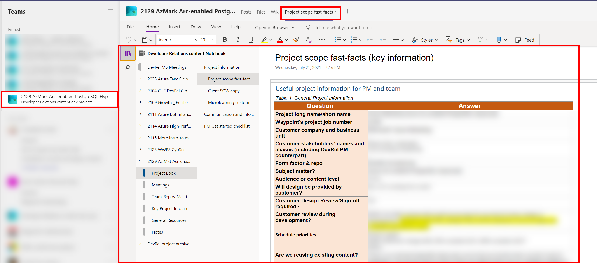

To author or edit a course, SME Writers (SMEs), Instructional Designers (IDs), Microlearning Specialists (MLS), and others who write or edit content need to install and use several specific tools.

## Tools you will need

Tools you will need include:

- Microsoft Word. You must be comfortable using Track Changes and comments within Word, and you also must be comfortable using built-in heading and paragraph-tag styles. You also might need to install and use specific templates. 
- Microsoft Edge. We recommend that you use Edge Chromium for Corpnet-accessed content.

## Tools you might need

Depending on your job role and the particular project you’re working on, you might also need to install:

- [Visual Studio Code](https://waypointventures.github.io/docs/install/install-vsc.html). VSC is a powerful editing tool that enables you to develop, debug, and collaborate on code. We predominantly use it for creating and editing markdown content. Additionally, note that there are several VSC extensions you’ll need, including the [Docs Authoring Pack](https://waypointventures.github.io/docs/install/install-author-pack.html), Acrolinx for Visual Studio Code, and several docs.microsoft.com and GitHub extensions. For a complete list of extensions, visit [Visual Studio Code](https://waypointventures.github.io/docs/install/install-vsc.html) and follow the links under **Install software** in the menu.
- Typora. Typora is an editing tool you can use to convert Microsoft Word files to markdown and edit markdown files directly.

    >**Note:** Upon customer approval, we do prefer to develop and review microlearning content in Word. Therefore, it’s possible that only the Microlearning Specialist (MLS) will need or use VSC or Typora.

- Microsoft PowerPoint or Visio. You can use these programs to create mockups of conceptual graphics and diagrams.
- An image editor such as Snagit or Paint 3D. You can use these tools to crop and apply other edits to screenshots, such as removing personal information.

## Tools with which you should be familiar

You should have familiarity using:

- SharePoint, in particular, SharePoint libraries.
- Microsoft Teams. You’ll need this to access many project resources, as well as participating in Teams meetings, chats, and sharing files.
- Familiarity with GitHub, Azure DevOps, and Acrolinx.
- Microsoft OneNote. You’ll need this primarily to access the Project Book.

    >**Note:** You can access the Project Book in Teams (as depicted in the following screenshot). In Teams, the Project Book is an embedded OneNote file, so understanding how to “get around” in OneNote is helpful.

    

